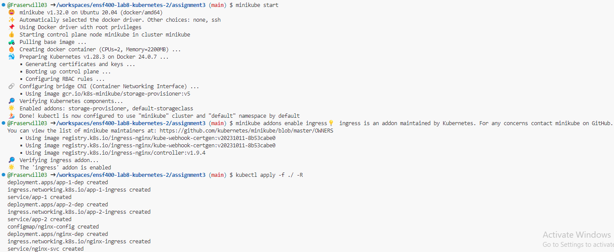
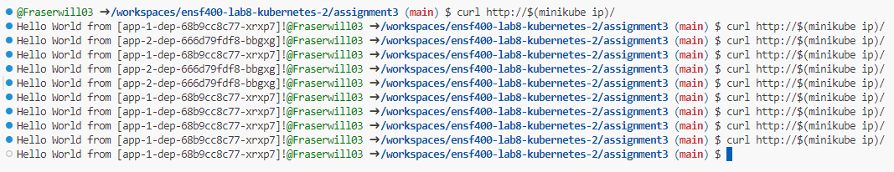
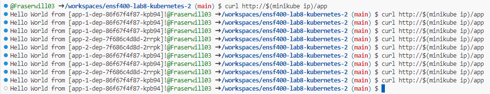

# ENSF 400 Assignment 3
**William Fraser ~ 30158991**

## Steps to run:
### 1. Start minikube
In order to begin, one must first start minikube. This can be done with the following command:

```bash
minikube start
```

### 2. Enable ingress controller
The next step is to enable the ingress controller addon. This is done with the commmand:

```bash
minikube addons enable ingress
```

### 3. Apply Resource Configuration 
In order to apply changes to the kubernetes resources, or in this case, create them, run the following command from the directory containing all of my /yaml files.

```bash
kubectl apply -f ./ -R 
```

This essentially runs the apply command recursively for all files in the directory.

### 4. Test Output
In order to test the output we can run one the following two commands:

```bash
curl http://$(minikube ip)/
```

This will use the `nginx-ingress` to redirect the request coming into minikube to the nginx pods defined in `nginx-dep`. This will be redirected becuase `nginx-ingress` looks for requests with the '/' prefix. This then goes through our load balancer, and if you run multiple times you can see the response coming from both app-1 and app-2 deployments.

You can also run

```bash
curl http://$(minikube ip)/app
```

which skips our nginx pods and uses the `app-1-ingress` and `app-2-ingress` to directly send the request to the `app-1` and `app-2` pods. This is still load balanced as the 30-70 canary balancing is setup through the apps' ingresses.

```bash
curl http://$(minikube ip)/app
```

Example outputs are shown below:

### Setup:


### Output from `curl http://$(minikube ip)/`


As you can see, out of 10 requests, 7 got routed to `app-1` and 3 got routed to `app-2`. This is in line with what we would expect from the way we setup the canary load balancing.

### Output from `curl http://$(minikube ip)/app`


I have additionally added this screenshot to show the `app-1` and `app-2` ingress in action independantly.
